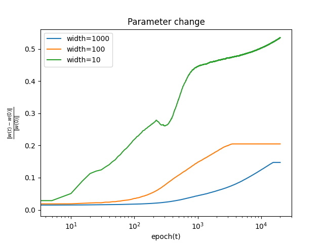
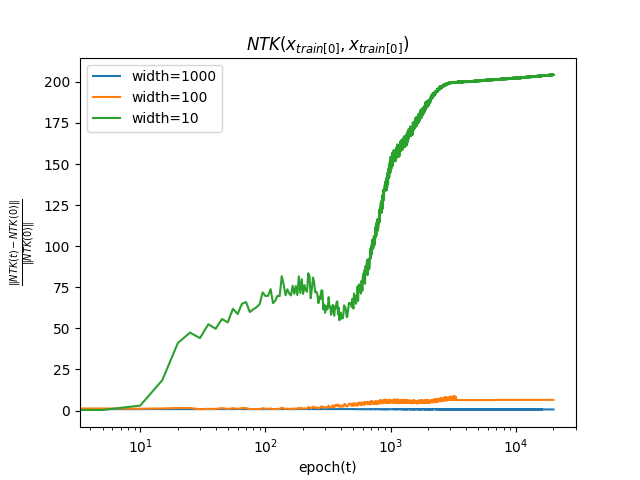
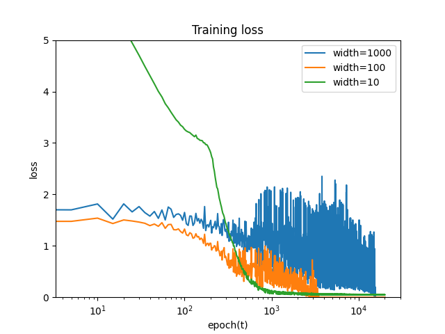

# Neural Tangent Kernel Experiments

Experimental code to investigate the validity of Neural Tanget Kernel (NTK) theory in finite width.
The blog post about this experiment is [here](https://speed1313.github.io/posts/ntk/).


# How to Use
```
$ rye run python3 src/ntk/ntk_expermient.py --epoch 20000 --mode minibatch --batch_size 1 --depth 5 --lr 0.001
```

<table>
<tr>
<td></td>
<td></td>
<td></td>
</tr>
</table>